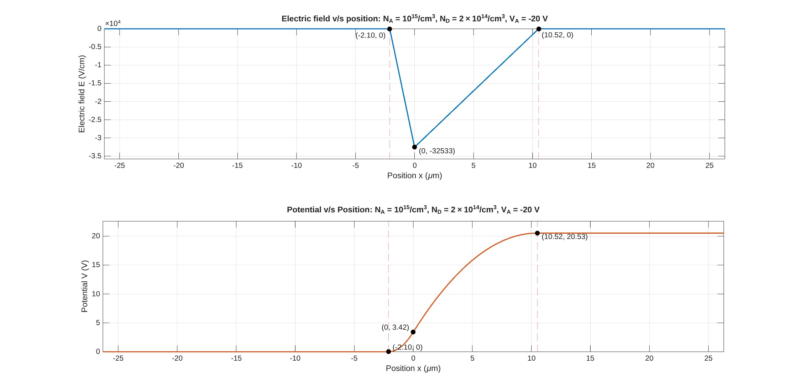
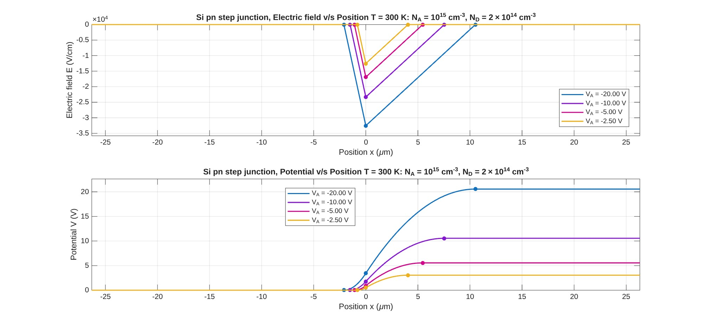
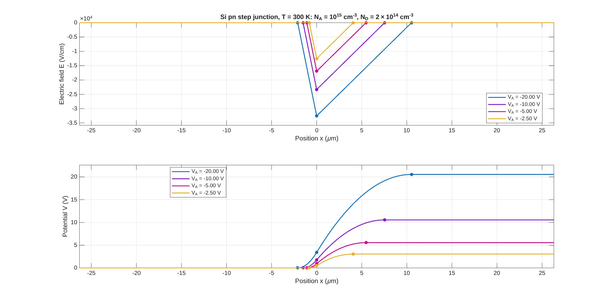
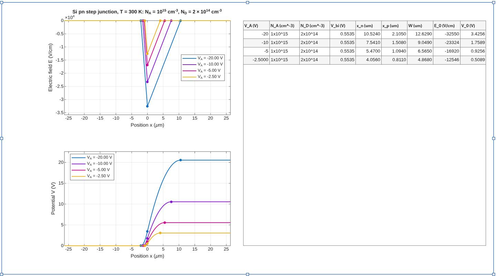
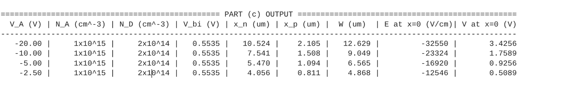
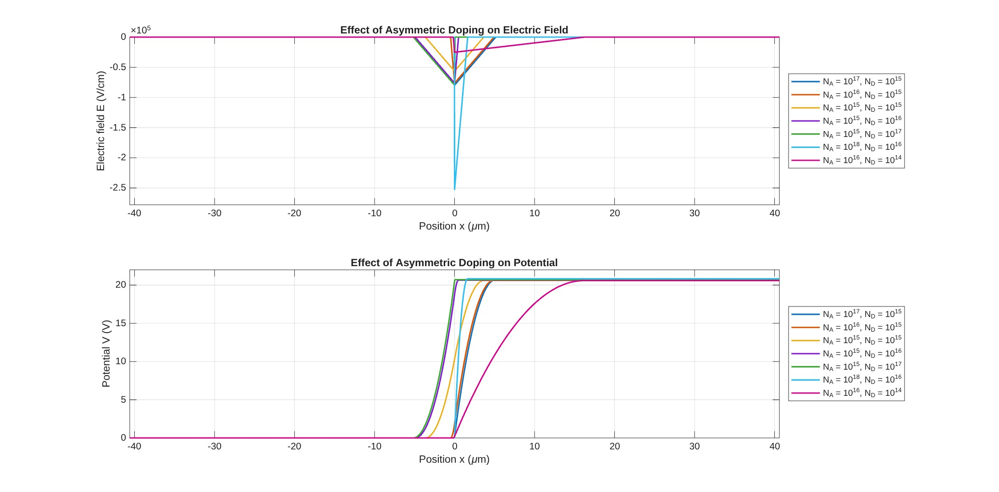

# EDC Assignment --- PN Step-Junction Analysis

## Overview

This repository contains a MATLAB-based computational analysis of a
**nondegenerately doped silicon PN step junction**.

The scripts calculate and visualize the **electric field** and
**electrostatic potential** across an abrupt PN junction. The analysis
considers:

-   A single reverse-bias condition
-   Several reverse-bias voltages
-   Numerical output of junction parameters
-   Different and highly asymmetric doping concentrations

The plots generated by the scripts are included in the `Images/`
directory so that the main results can be viewed directly from the
repository.

------------------------------------------------------------------------

## What is being analysed?

The junction is treated using the **depletion approximation**. The
calculation determines the depletion region and then obtains the
electric-field and potential profiles from the charge distribution.

The main quantities calculated are:

\[
V\_{bi}=V_T`\ln`{=tex}`\left`{=tex}(`\frac{N_A N_D}{n_i^2}`{=tex}`\right`{=tex})
\]

\[ V_j=V\_{bi}-V_A \]

\[ W=`\sqrt{\frac{2\epsilon V_j}{q}
\left(\frac{1}{N_A}+\frac{1}{N_D}\right)}`{=tex} \]

where:

-   (V\_{bi}) is the built-in potential
-   (V_j) is the total junction potential drop
-   \(W\) is the total depletion width
-   (N_A) and (N_D) are the acceptor and donor concentrations
-   (V_A) is the applied voltage
-   \(q\) is the electronic charge
-   (`\epsilon`{=tex}) is the permittivity of silicon

The depletion widths on the two sides are obtained from charge
neutrality:

\[ x_n=`\frac{W N_A}{N_A+N_D}`{=tex}, `\qquad`{=tex}
x_p=`\frac{W N_D}{N_A+N_D}`{=tex} \]

The scripts then construct the piecewise electric-field and potential
profiles.

------------------------------------------------------------------------

# Repository Structure

``` text
EDC-Assignment/
│
├── Scripts/
│   ├── parta.m
│   ├── partb.m
│   ├── partc.m
│   └── partd.m
│
├── Images/
│   ├── parta.jpg
│   ├── partb.jpg
│   ├── partc.jpg
│   ├── partc2.jpg
│   ├── partc3.jpg
│   └── partd.jpg
│
└── README.md
```

------------------------------------------------------------------------

# Requirements

### Software

-   **MATLAB**
-   No additional external toolbox is required for the calculations used
    in these scripts.

The scripts use standard MATLAB functionality such as plotting,
numerical expressions, loops, logical indexing, and `uitable`.

### Units

The calculations use:

-   Doping concentrations: (`\mathrm{cm^{-3}}`{=tex})
-   Position internally: cm
-   Position in plots: (`\mu`{=tex}`\mathrm{m}`{=tex})
-   Electric field: V/cm
-   Potential: V
-   Temperature: K

------------------------------------------------------------------------

# Running the Analysis

1.  Download or clone this repository.
2.  Open MATLAB.
3.  Set MATLAB's **Current Folder** to the repository directory.
4.  Open the `Scripts` folder.
5.  Run the scripts individually:

``` matlab
parta
partb
partc
partd
```

Each script opens its own figure containing the corresponding results.

The pre-generated figures are also available in `Images/`.

------------------------------------------------------------------------

# Part A --- Single Reverse-Bias Analysis

**Script:** [`Scripts/parta.m`](Scripts/parta.m)

Part A considers a silicon PN step junction at:

-   (T=300,`\mathrm{K}`{=tex})
-   (N_A=10\^{15},`\mathrm{cm^{-3}}`{=tex})
-   (N_D=2`\times10`{=tex}\^{14},`\mathrm{cm^{-3}}`{=tex})
-   (V_A=-20,`\mathrm{V}`{=tex})

The script calculates the built-in potential, total potential drop,
depletion width, depletion penetration on both sides, peak electric
field, and potential at the junction.

For this case, the calculated values shown by the script include
approximately:

  Quantity            Value
  ----------- -------------
  (V\_{bi})        0.5535 V
  (V_j)           20.5535 V
  (x_n)           10.524 µm
  (x_p)            2.105 µm
  \(W\)           12.629 µm
  (E(0))        −32550 V/cm
  (V(0))           3.4256 V

### Electric Field and Potential



The electric field is confined to the depletion region and reaches its
largest magnitude at the junction. The potential increases across the
depletion region and becomes constant outside it.

------------------------------------------------------------------------

# Part B --- Effect of Applied Reverse Bias

**Script:** [`Scripts/partb.m`](Scripts/partb.m)

Part B keeps the doping concentrations fixed:

\[ N_A=10\^{15},`\mathrm{cm^{-3}}`{=tex}, `\qquad`{=tex}
N_D=2`\times10`{=tex}\^{14},`\mathrm{cm^{-3}}`{=tex} \]

and compares four reverse-bias conditions:

\[ V_A=-20,;-10,;-5,;-2.5 `\mathrm{V}`{=tex} \]

The electric-field and potential profiles are calculated separately for
each voltage and displayed together for comparison.

### Observed behaviour

As the magnitude of reverse bias increases:

-   The depletion region becomes wider.
-   The magnitude of the peak electric field increases.
-   The total potential drop across the junction increases.
-   The potential profile extends over a larger depletion region.



------------------------------------------------------------------------

# Part C --- Quantitative Comparison

**Script:** [`Scripts/partc.m`](Scripts/partc.m)

Part C performs the same multi-voltage analysis as Part B, but
additionally collects the calculated junction parameters into a MATLAB
table.

The four cases are:

  -----------------------------------------------------------------------
        (V_A)  (x_n) (µm)  (x_p) (µm)  \(W\) (µm)      (E(0))  (V(0)) (V)
                                                       (V/cm) 
  ----------- ----------- ----------- ----------- ----------- -----------
        −20 V      10.524       2.105      12.629      −32550      3.4256

        −10 V       7.541       1.508       9.049      −23324      1.7589

         −5 V       5.470       1.094       6.565      −16920      0.9256

       −2.5 V       4.056       0.811       4.868      −12546      0.5089
  -----------------------------------------------------------------------

The generated graphical comparison is:



The script also produces a combined figure containing the plots and the
numerical table:



The table-only output is also retained:



------------------------------------------------------------------------

# Part D --- Effect of Asymmetric Doping

**Script:** [`Scripts/partd.m`](Scripts/partd.m)

Part D keeps the applied voltage fixed at:

\[ V_A=-20,`\mathrm{V}`{=tex} \]

and studies several combinations of (N_A) and (N_D):

    (N_A) (cm⁻³)   (N_D) (cm⁻³)
  -------------- --------------
      (10\^{17})     (10\^{15})
      (10\^{16})     (10\^{15})
      (10\^{15})     (10\^{15})
      (10\^{15})     (10\^{16})
      (10\^{15})     (10\^{17})
      (10\^{18})     (10\^{16})
      (10\^{16})     (10\^{14})

The purpose is to show how the relative doping concentrations affect the
depletion-region widths, electric field, and potential.

### Observed behaviour

When one side is much more heavily doped than the other, most of the
depletion region extends into the more lightly doped side. The resulting
electric-field and potential profiles therefore become strongly
asymmetric.



------------------------------------------------------------------------

# Main Results

The simulations demonstrate several important trends in an abrupt PN
step junction:

### 1. Reverse bias increases depletion width

Increasing the magnitude of reverse bias increases the total junction
potential and therefore increases the depletion width.

### 2. Electric field increases with reverse bias

The peak electric-field magnitude increases as the applied reverse bias
becomes more negative.

### 3. The potential drop increases with reverse bias

The electrostatic potential reaches a higher final value for larger
reverse-bias magnitude.

### 4. Doping asymmetry controls depletion penetration

The depletion region does not generally extend equally into both sides
of the junction. The more lightly doped side supports a larger share of
the depletion width.

### 5. Strongly asymmetric junctions approach one-sided behaviour

For large differences between the two doping concentrations, the
depletion region is concentrated predominantly on the lightly doped
side.

------------------------------------------------------------------------

# Method Used

The scripts use the depletion approximation for an abrupt PN junction.

The electric field is constructed from the charge density using
Poisson's equation:

\[ `\frac{dE}{dx}`{=tex}=`\frac{\rho}{\epsilon}`{=tex} \]

and the electrostatic potential is related to the electric field by:

\[ E=-`\frac{dV}{dx}`{=tex} \]

Charge neutrality across the depletion region is used to determine the
relative depletion widths:

\[ N_Ax_p=N_Dx_n \]

The resulting piecewise expressions are evaluated over a position array
and plotted using MATLAB.

------------------------------------------------------------------------

# Reproducing the Figures

The figures stored in `Images/` are the results included with the
repository.

To regenerate them:

``` text
MATLAB
  ↓
Open repository
  ↓
Open Scripts/
  ↓
Run parta.m / partb.m / partc.m / partd.m
  ↓
Corresponding result figures are generated
```

The scripts use `clear`, `clc`, and `close all` at the beginning so that
each run starts with a clean MATLAB workspace and figure state.

------------------------------------------------------------------------

# Files at a Glance

  -----------------------------------------------------------------------
  File                                Purpose
  ----------------------------------- -----------------------------------
  `Scripts/parta.m`                   Single reverse-bias calculation and
                                      profiles

  `Scripts/partb.m`                   Comparison of four reverse-bias
                                      voltages

  `Scripts/partc.m`                   Multi-voltage analysis with
                                      numerical output table

  `Scripts/partd.m`                   Analysis of asymmetric doping

  `Images/parta.jpg`                  Part A electric-field and potential
                                      plots

  `Images/partb.jpg`                  Part B comparison plots

  `Images/partc.jpg`                  Part C comparison plots

  `Images/partc2.jpg`                 Part C numerical output

  `Images/partc3.jpg`                 Part C combined plots and table

  `Images/partd.jpg`                  Part D asymmetric-doping plots
  -----------------------------------------------------------------------

------------------------------------------------------------------------

## Repository

[EDC Assignment ---
GitHub](https://github.com/tsylatac37/EDC-Assignment)
